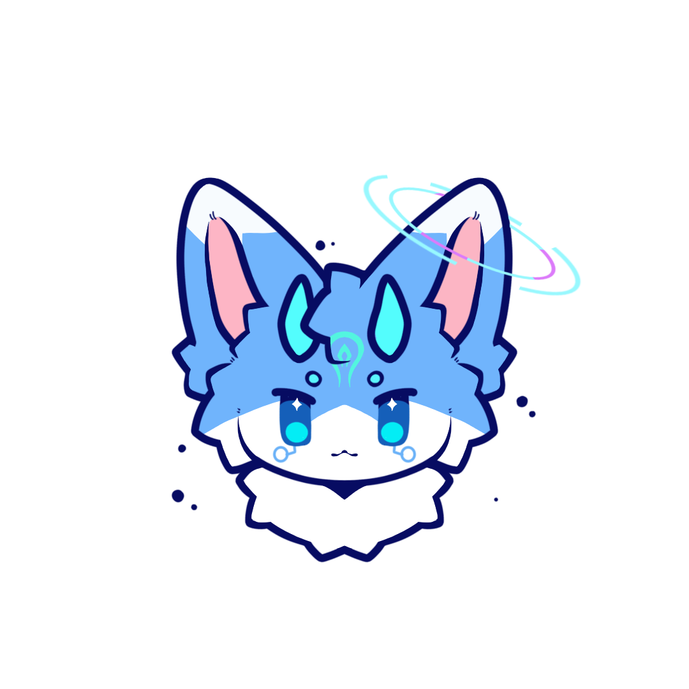

| 
锐冰   {width=128 height=128 laze=false}
 |
| :-----------------------------------------------------------------------------------------------------: |
|                  **基本信息**   名字： 锐冰   英文：SharpIce   性别：男                  |
|                 **物种**   物种： Furry   分类：神兽   生物：龙、鱼混种                  |
|   **外貌**   身体颜色： 白色、矢车菊蓝、青色   瞳孔：蓝色瞳、横矩形瞳孔  身高：1.7 米    |
|                                      **其他**   魔法属性：冰                                       |

## 概述

&ensp;&ensp;锐冰是卵生生物，在一次威胁中孵化并保护自己免受威胁，但关于这个卵的起源仍是个谜。

## 外貌

&ensp;&ensp;锐冰是融合了「龙」和「鱼」的物种，其中「鱼」的特征占 95%，而「龙」的特征仅占 5%。

### 基本特征

&ensp;&ensp;锐冰的身体主要以接近「矢车菊蓝」的颜色和「白色」构成，以「矢车菊蓝」为主色。眉毛和角的颜色为「青色」。脸上眼睛下有两个类似于放大镜的纹路

## 能力

### 战斗方面

&ensp;&ensp;锐冰在战斗中主要以魔法为主攻手段，权杖作为辅助攻击的武器，权杖主要用于防护（如格挡和反击）。此外，锐冰有时还会配备滑翔翼和机动翅膀，用于提升了飞行和机动能力，帮助在战斗或执行任务中时灵活移动和调整位置。

### 关于魔法

&ensp;&ensp;锐冰主要使用四个类别的魔法：

- 护佑
- 侵袭
- 协同
- 念力
