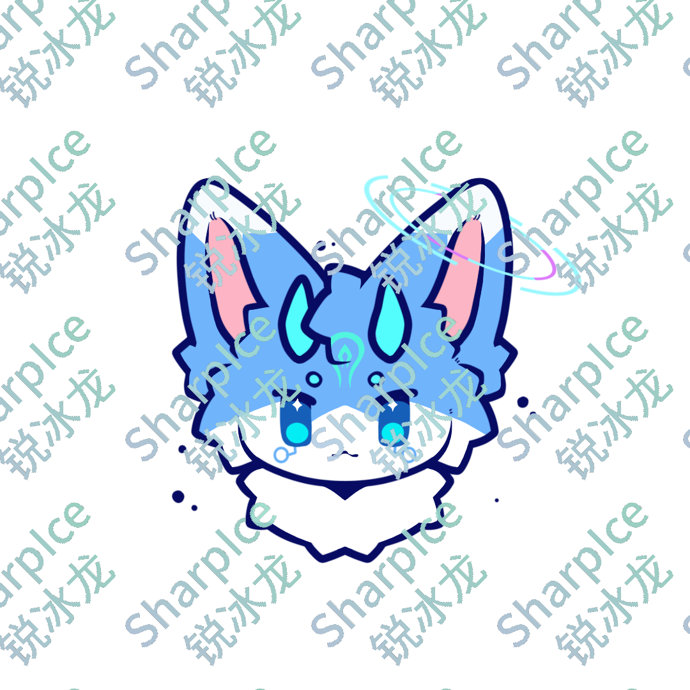

|          锐冰   {width=128 height=128}          |
| :-------------------------------------------------------------------------------------------: |
| **基本信息**   中文名： 锐冰   英文名：SharpIce   性别：男   身高：1.8 米 |
|            **物种**   物种： Furry   分类：神兽   生物：龙、鱼混种             |
|        **外貌**   身体颜色： 白色、矢车菊蓝、青色   瞳孔：蓝色瞳、横矩形瞳孔        |
|                                 **其他**   魔法属性：冰                                  |

## 概述

&ensp;&ensp;这个角色被命名为锐冰，是一种卵生生物，在一次威胁中孵化并保护自己免受威胁。但关于这个卵的起源是未知的。

## 外貌

&ensp;&ensp;锐冰是融合了「龙」和「鱼」的物种，其中「鱼」的特征占 95%，而「龙」的特征仅占 5%。

### 基本特征

&ensp;&ensp;锐冰的身体主要以接近「矢车菊蓝」的颜色和「白色」构成，以「矢车菊蓝」为主色。眉毛和角的颜色为「青色」。脸上眼睛下有两个类似于放大镜的纹路

## 能力

### 战斗方面

&ensp;&ensp;锐冰在战斗中主要以**魔法**为主，冷兵器为防护。锐冰习惯使用**权杖**作为武器。

### 关于魔法

&ensp;&ensp;锐冰主要使用四个魔法：

- 护佑
- 侵袭
- 协同
- 念力
